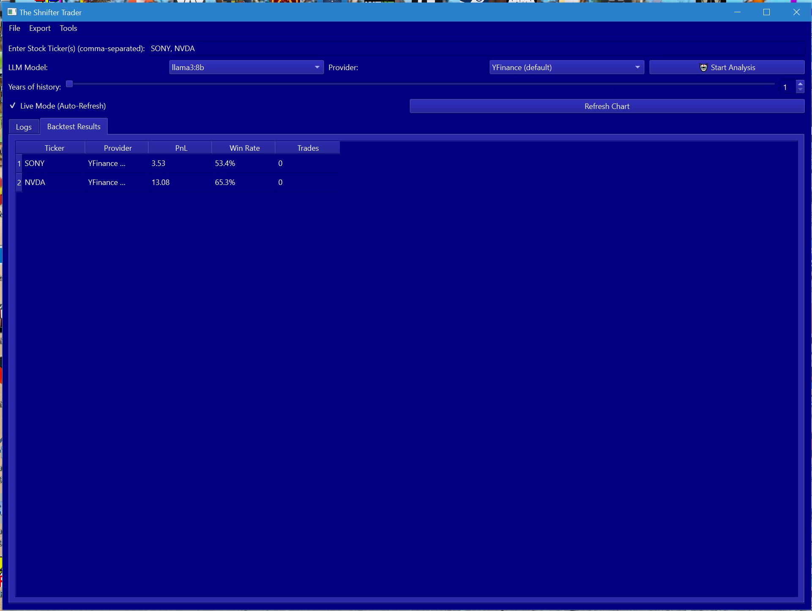
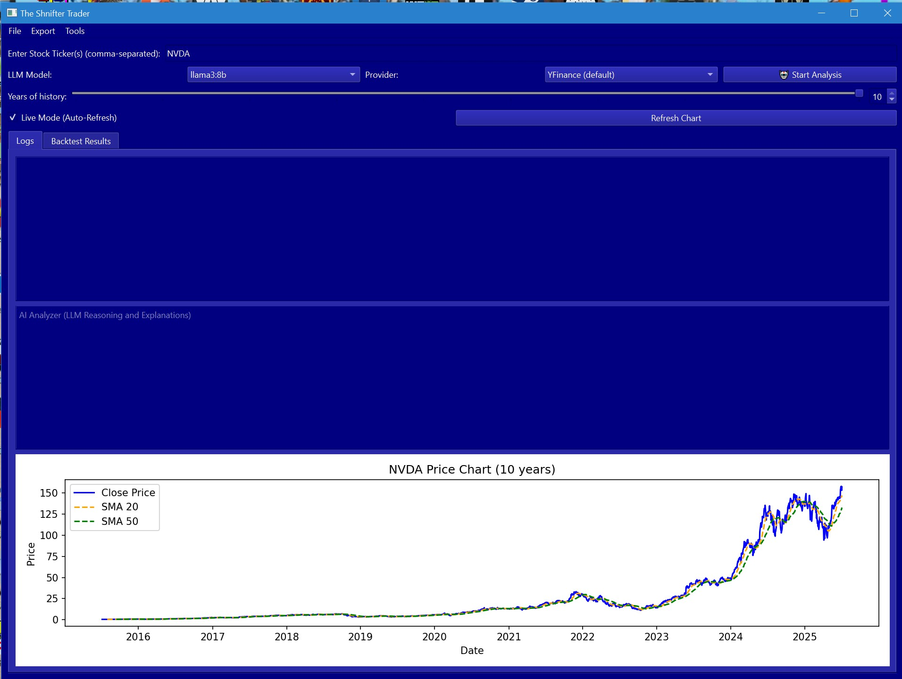

# The Shnifter Trader
by KingAi, Jason King, South Australia.
[](https://github.com/KingAiCodeForge/shnifter-trader)

Im average at coding, this is a project i spent 2 hours on using vscode. idea was a ai powered auto trader called shnifter after the name of a mate i have on steam and discord, who said he wanted a autonomous trader... future intergrations will be openhands, autoMate, maybe openmanus or agentzero and agentgym. wired to the eventbus of course. EDA, more llm models and then a validation loop between ai models, or multi step system or parralel system. before output or commands issued.

The Shnifter Trader is a fully autonomous AI-powered stock trading assistant for Windows desktops. It leverages a multi-model decision system to provide real-time buy, sell, or hold recommendations using:

- **Technical Analysis** (SMA crossover)
- **Machine Learning** (Random Forest on price deltas)
- **Sentiment Analysis** (VADER on live news)
- **LLM Reasoning** (Ollama: llama3, gemma, etc.)

---

## 🚀 Features

- **Multi-Model Decision Engine**: Consensus voting (2 of 3 models must agree)
- **Trend Model**: SMA 20 vs SMA 50 crossover
- **ML Model**: RandomForest classifier on live price movements
- **Sentiment Model**: News-based polarity scoring
- **LLM Reasoning**: Human-readable explanations via Ollama
- **EventBus Architecture**: Centralized logging to GUI, file, and console
- **PySide6 GUI**: Multi-ticker input, log window, color-coded messages, charting
- **Autonomous Execution**: Re-analyzes tickers every 10 minutes
- **Backtesting**: Simple backtest module in GUI
- **Export**: Logs and last decisions to TXT, CSV, JSON

---

## 🛠️ Requirements

- Windows 10/11
- Python 3.13 (required)
- [Ollama](https://ollama.com/) (local LLM server)
- At least one Ollama model (e.g., llama3:8b)
- All Python dependencies in `requirements.txt`

---

## ⚡ Setup

1. **Clone the repository:**
   ```sh
   git clone https://github.com/yourusername/The_Shnifter_Trader.git
   cd The_Shnifter_Trader
   ```
2. **Run the setup script (Windows):**
   ```sh
   start_shnifter_setup.bat
   ```
   - This creates a `.venv` using Python 3.13, upgrades pip, and installs all requirements.
   - **Python 3.13 is required. Do not use Python 3.11.**
3. **Start Ollama and pull a model:**
   ```sh
   ollama serve
   ollama pull llama3:8b
   ```
4. **Launch the app:**
   ```sh
   start_shnifter.bat
   ```
   - This activates the venv and runs the GUI.

**Other scripts:**
- `activate_venv.bat`: Activate the venv in your current shell (cmd or PowerShell)
- `open_venv_shell.bat`: Open a new cmd window with the venv activated

---

## 🖥️ Usage

- Enter tickers (e.g., AAPL, MSFT, SONY) in the GUI.
- View real-time recommendations, logs, and price charts.
- Use the menu to export logs or last decisions to TXT, CSV, or JSON.
- Use the backtest tool from the GUI for simple strategy simulation.
- Enable "Live Mode" for auto-refreshing charts.
- All logs are saved to `shnifter_log.txt`, `shnifter_log.csv`, and `shnifter_log.json`.

---

## 🧩 Architecture

- **EventBus**: Broadcasts DEBUG, ERROR, INFO events
- **EventLog**: Centralizes logs to GUI, file (`shnifter_log.txt`), and console
- **LLM Integration**: Uses Ollama for natural language feedback and reasoning
- **.bat Scripts**: For setup, launching, and environment management

---

## 🧪 Testing

Run tests with:
```sh
python -m unittest test_shnifter.py
```

---

## 📄 License

MIT License

---

## 🖼️ Screenshot



### Example: NVDA Price Chart



## 🧠 Advanced LLM Features

- **Dual-LLM Mode**: Analyzer and Verifier LLMs (selectable, independently) for self-checking, multi-pass trade validation
- **LLM Manager Popout**: Toggle dual-LLM mode, select models, and see real-time status (active/inactive)
- **Dynamic Model Detection**: Auto-detects available Ollama models, supports refresh
- **Menu Actions**: Run single, dual, or double-pass LLM analysis from the GUI
- **Event-Driven Everything**: All user actions, model changes, and analysis results are logged and visible in the Event Log popout

## 📈 Real-Time & Modular

- **Real-Time Analysis**: Multi-ticker, multi-threaded, with live log and chart updates
- **Modular Backend**: Easily extend with new models, providers, or strategies
- **Popout Windows**: Event log and LLM manager popouts for advanced control

## 🚦 How Dual-LLM Mode Works

1. **Analyzer LLM**: Generates a trade recommendation and reasoning
2. **Verifier LLM**: Critiques/confirms/revises the Analyzer's output
3. **Final Action**: Only after both passes is a trade signal generated and logged

I am building Shnifter Trader using custom, original code and ideas. Some inspiration comes from open source projects, but all code is refactored and original for Python 3.13.2.
